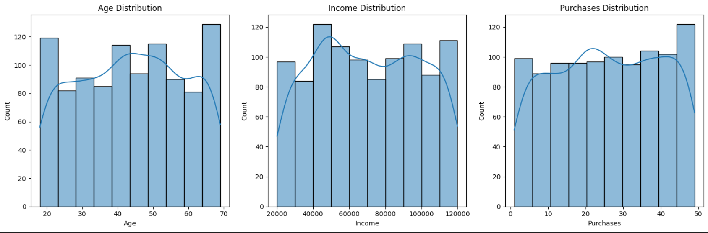

# 📊 Customer Churn Prediction Project

## 📸 Screenshot

---

## 📌 Overview
This project is about **predicting customer churn** using purchase behavior data.  
The dataset was collected from multiple sources:
- 📂 CSV file (`customers.csv`)
- 🗂️ JSON file (`customers.json`)
- 🛢️ SQL database (`customers.db`)
- 🌐 API (OMDB example integration)

We performed:
- 🔹 Data Acquisition  
- 🔹 Data Cleaning & Preprocessing  
- 🔹 Exploratory Data Analysis (EDA)  
- 🔹 Data Profiling (ydata-profiling / Sweetviz)  
- 🔹 Framed ML Problem Statement  

---

## 🛠️ Steps Completed
### Part A: Fundamentals
✔️ Defined Data Analysis  
✔️ Planned Data Science Project lifecycle  
✔️ Framed ML Problem (Churn Prediction)  
✔️ Explained Tensors with NumPy examples  

### Part B: Data Acquisition
✔️ Loaded data from CSV, JSON, SQL, API  

### Part C: Data Understanding & Cleaning
✔️ Initial exploration with `head()`, `info()`, `describe()`  
✔️ Handled missing values & duplicates  
✔️ Fixed data types  
✔️ Dropped irrelevant columns  

### Part D: Exploratory Data Analysis (EDA)
✔️ Univariate Analysis – Age, Income, Purchases  
✔️ Bivariate Analysis – Gender vs Purchases, Income vs Churn  
✔️ Multivariate Analysis – Correlation Heatmap, Pair Plots  

---

## 🚀 Tech Stack
- Python 🐍  
- Pandas & NumPy 🔢  
- Matplotlib & Seaborn 📊  
- SQLite 🛢️  
- API requests 🌐  

---

## ✅ Next Steps
- Feature Engineering  
- ML Model Training (Logistic Regression / Random Forest)  
- Model Evaluation & Deployment  

---